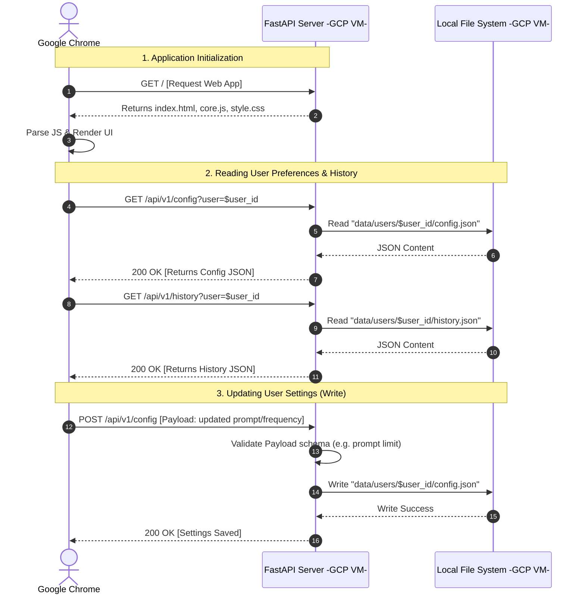

# Client-Server Architecture & Data Flow

This document outlines the interaction between the user's browser, the central AI Newsletter API server, and the local file system storage.

## Execution Environment
- **Hosting**: A single Google Cloud Platform (GCP) Virtual Machine (e.g., e2-micro/small).
- **Web App Delivery**: The FastAPI server acts as both the static file host (serving the compiled Vue/React JS bundles and HTML) and the JSON API backend.
- **Storage**: The API Server runs on the same VM as the local file system storage (`data/` directory). No external databases are used for preferences or history.

## Sequence Diagram

Below is the execution flow demonstrating how the application loads and how read/write operations occur.

