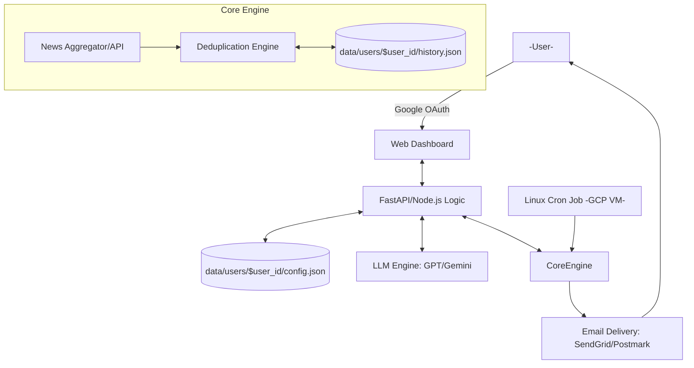

# Technical Design: AI-Powered Smart Newsletter System (Simplified)

## 1. System Architecture (GCP Local-First)

The system is designed for simplicity, intended to run on a single Google Cloud Platform (GCP) Virtual Machine (VM). It uses local file system storage for data and native Linux `cron` for task scheduling.



## 2. Component Details

### 2.1 Deduplication Engine (The "Memory" Layer)
To solve the repetition problem, we implement a multi-stage filter:
1.  **Vector Store Semantic Search**: Every potential news snippet is converted into a vector embedding. Before including it in a newsletter, we perform a similarity search against the `sent_history.json`. If the cosine similarity exceeds a threshold (e.g., 0.85), it's rejected.
2.  **Canonical URL Tracking**: Store unique identifiers (URLs/IDs) of all summarized articles in `sent_history.json`.
3.  **LLM Cross-Check**: The LLM is provided with a list of "Topics covered in the last [X] days" in its context window to ensure thematic variety.

### 2.2 Configuration Interface
- **State Management**: Uses simple JSON reads/writes to update a user's delivery frequency and prompt.
- **Interests Prompt**: Users provide a text prompt (up to 100 words), which is directly passed to the LLM during the summary phase to dictate newsletter focus.

### 2.3 Delivery Pipeline (Simplified)
- **Scheduling**: Uses native Linux `cron` on the GCP VM.
    - **Global Dispatcher**: A recurring task (`* * * * *` or similar hourly/daily trigger) that iterates through all `data/users/` directories and triggers generation based on individual `config.json` frequency settings and current time.
- **Synthesizer**:
    - **Daily**: Summarizes raw news.
    - **Weekly/Monthly**: Uses "Recursive Summarization" (summarizing the daily summaries) to maintain context without exceeding token limits.

## 3. Data Model (Local Filesystem Structure)

```text
data/
├── users/
│   ├── {user_id_A}/
│   │   ├── config.json       (Custom Prompt, Frequency)
│   │   └── history.json      (Sent Content History, Embeddings)
│   └── {user_id_B}/
│       ├── config.json
│       └── history.json
```

### config.json
- `user_id`: UUID
- `email`: String
- `prompt`: String (up to 100 words outlining reading interests)
- `frequency`: Enum (DAILY, WEEKLY, MONTHLY)

### history.json
- `content_id`: UUID
- `payload_hash`: String (for fast exact match)
- `embedding`: Vector
- `sent_at`: Timestamp

## 4. Error Handling
- **Transaction Logs**: Every newsletter sent is logged locally. If a "Daily" fails, the system logs the error to `errors.log`.
