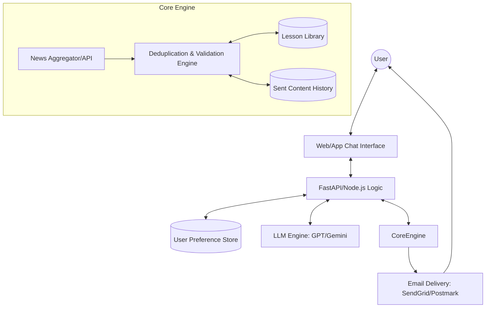

# Technical Design: AI-Powered Smart Newsletter System

## 1. System Architecture

The system follows a modular architecture to separate content acquisition, processing, and delivery.

## 2. Component Details

### 2.1 Deduplication Engine (The "Memory" Layer)
To solve the repetition problem, we implement a multi-stage filter:
1.  **Vector Store Semantic Search**: Every potential news snippet is converted into a vector embedding. Before including it in a newsletter, we perform a similarity search against the `Sent Content History`. If the cosine similarity exceeds a threshold (e.g., 0.85), it's rejected.
2.  **Canonical URL Tracking**: Store unique identifiers (URLs/IDs) of all summarized articles.
3.  **LLM Cross-Check**: The LLM is provided with a list of "Topics covered in the last [X] days" in its context window to ensure thematic variety.

### 2.2 Lesson Library & Self-Correction
- **Schema**: `{ error_id, timestamp, error_type, original_prompt, output, correction, preventive_rule }`.
- **Workflow**:
    1.  **Detection**: Triggered by user feedback or automated validation failures.
    2.  **Synthesis**: An LLM analyzes the error and produces a "Preventive Rule".
    3.  **Inclusion**: Every new generation prompt includes a "Relevant Lessons" section, populated by finding similar past errors in the library.

### 2.3 Conversational Interface
- **State Management**: Uses a state machine to handle "Draft" vs "Active" configurations.
- **Rollback Mechanism**: Implements an "Event Sourcing" pattern for user settings. Each change is a discrete event. "Undo" simply means reverting to the previous state index.

### 2.4 Delivery Pipeline
- **Scheduling**: Redis/BullMQ or Celery for managing Daily/Weekly/Monthly cron jobs per user timezone.
- **Synthesizer**:
    - **Daily**: Summarizes raw news.
    - **Weekly/Monthly**: Uses "Recursive Summarization" (summarizing the daily summaries) to maintain context without exceeding token limits.

## 3. Data Model

### User Configuration
- `user_id`: UUID
- `interests`: List[String]
- `frequency`: Enum (DAILY, WEEKLY, MONTHLY)
- `version_history`: List[SettingsState]

### Content History
- `content_id`: UUID
- `user_id`: FK
- `payload_hash`: String (for fast exact match)
- `embedding`: Vector
- `sent_at`: Timestamp

## 4. Error Handling & Rollback
- **Transaction Logs**: Every newsletter sent is logged. If a "Daily" fails, the system can retry or alert the user.
- **Version Control for Prompts**: System prompts are versioned so that a "rollback" can also affect the AI's behavior if a new prompt version causes regressions.
